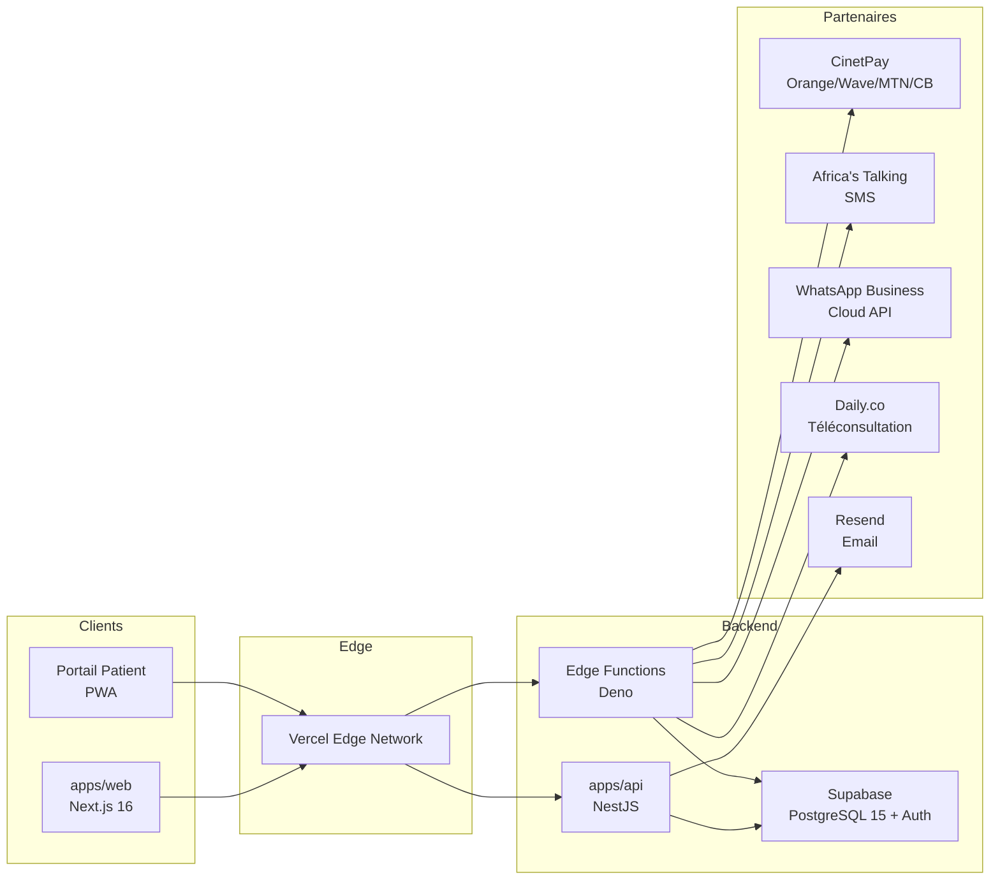
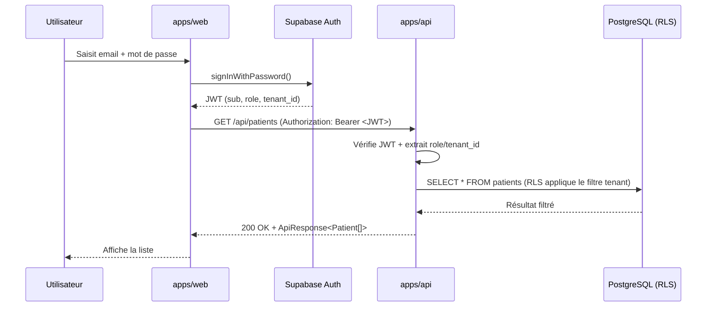

# Architecture — MediSaaS CI

> Vue d'ensemble de l'architecture technique, de l'isolation multi-tenant
> et des flux d'authentification et de chiffrement.

## 1. Vue d'ensemble du monorepo

Le projet est structuré en monorepo **Turborepo** géré par **Bun**. Trois
types de packages co-existent :

- **`apps/`** : applications déployables (web, api)
- **`packages/`** : bibliothèques partagées (types, db, ui-kit)
- **`supabase/`** : migrations SQL + Edge Functions Deno
- **`docs/`** : documentation technique

```
medisaas-ci/
├── apps/
│   ├── web/                 # Next.js 16 (App Router) — frontend patient + cabinet
│   └── api/                 # NestJS — API REST métier (Backend-for-Frontend)
├── packages/
│   ├── shared-types/        # Types TypeScript partagés (DTO, enums, ApiResponse<T>)
│   ├── database/            # Client Prisma + migrations + seed
│   └── ui-kit/              # Composants shadcn/ui réutilisables + Brand MediSaaS
├── supabase/
│   ├── migrations/          # Migrations SQL horodatées (RLS, audit, chiffrement)
│   ├── functions/           # Edge Functions Deno (webhooks, cron, notifications)
│   └── seed.sql             # Données de démonstration (Clinique du Plateau)
├── docs/                    # Cette documentation
├── prisma/schema.prisma     # Schéma multi-tenant (source de vérité)
├── turbo.json               # Pipeline build/dev/lint/test
└── package.json             # Workspaces Bun
```

### Schéma Mermaid — Vue d'ensemble



## 2. Multi-tenant — Isolation des données

MediSaaS CI est **multi-tenant par isolation logique** (et non par schéma
ou base séparée). Chaque table métier possède une colonne `tenant_id`
référençant `tenants.id`.

### Stratégie d'isolation

| Niveau | Mécanisme |
|--------|-----------|
| Base de données | **Row Level Security (RLS)** PostgreSQL sur toutes les tables métier |
| JWT | `app_metadata.tenant_id` injecté à l'authentification |
| API | Middleware NestJS qui vérifie le `tenant_id` sur chaque requête |
| Frontend | `tenantId` dans le store Zustand, passé en header `X-Tenant-Id` |

### Politique RLS par défaut

```sql
-- Exemple : un utilisateur ne voit que les patients de son tenant
create policy "patients_select_own_tenant"
  on patients for select
  using (
    tenant_id = public.get_current_tenant_id()
  );
```

La fonction `get_current_tenant_id()` lit le JWT Supabase :

```sql
create or replace function public.get_current_tenant_id()
returns uuid
language sql stable security definer
as $$
  select nullif(
    (auth.jwt() -> 'app_metadata' ->> 'tenant_id'), ''
  )::uuid;
$$;
```

### Tables concernées

| Table | `tenant_id` | Notes |
|-------|-------------|-------|
| `tenants` | (self) | Politique : `id = tenant_id` ou `super_admin` |
| `users` | nullable | Un `super_admin` peut ne pas avoir de tenant |
| `patients` | obligatoire | Cascade delete avec tenant |
| `appointments` | obligatoire | |
| `consultations` | obligatoire | |
| `prescriptions` | obligatoire | |
| `invoices` | obligatoire | |
| `payments` | obligatoire | |
| `subscriptions` | obligatoire | 1 abonnement par tenant |
| `audit_logs` | nullable | Logs système sans tenant |

Voir `supabase/migrations/20240115100000_init_tenants_rls.sql` pour le
détail complet des politiques.

## 3. Flux d'authentification

### Stack

- **Supabase Auth** : gestion des comptes, sessions, JWT
- **JWT** : token signé contenant `app_metadata.role` et `app_metadata.tenant_id`
- **RBAC** : 6 rôles (`super_admin`, `admin_cabinet`, `medecin`, `secretaire`, `comptable`, `patient`)

### Schéma Mermaid — Login & requête authentifiée



### Contenu du JWT

```json
{
  "sub": "uuid-utilisateur",
  "email": "dr.kouassi@clinique-plateau.ci",
  "role": "authenticated",
  "app_metadata": {
    "role": "medecin",
    "tenant_id": "00000000-0000-0000-0000-000000000001",
    "patient_id": null
  },
  "user_metadata": {
    "name": "Dr. Aya Kouassi",
    "specialty": "Médecine générale"
  },
  "exp": 1735689600
}
```

### Middleware Next.js

Le fichier `src/middleware.ts` (voir dépôt) applique le RBAC au niveau
des routes Next.js :

```typescript
const ROUTE_ROLE_MATRIX: Record<string, string[]> = {
  "/dashboard/patients": ["super_admin", "admin_cabinet", "medecin", "secretaire"],
  "/dashboard/prescriptions": ["super_admin", "admin_cabinet", "medecin"],
  "/dashboard/billing": ["super_admin", "admin_cabinet", "secretaire", "comptable"],
  // ...
};
```

## 4. Chiffrement

### Au repos (AES-256)

Les champs médicaux sensibles sont chiffrés avec `pgcrypto` (extension
PostgreSQL officielle) :

| Table | Colonne chiffrée |
|-------|-------------------|
| `consultations` | `diagnosis`, `notes` |
| `prescriptions` | `notes` |
| `patients` | `allergies`, `chronic_conditions` |

```sql
-- Chiffrement
update consultations
  set diagnosis_enc = encrypt_medical_data('Hypertension artérielle')
where id = '...';

-- Lecture en clair (via la vue security_invoker)
select * from consultations_decrypted where id = '...';
```

La clé de chiffrement est injectée via la variable de session
`app.encryption_key` positionnée par l'API NestJS à chaque transaction :

```typescript
await prisma.$executeRaw`set local app.encryption_key = ${process.env.MEDICAL_ENCRYPTION_KEY}`;
```

**Rotation** : la fonction `rotate_medical_encryption(cipher, new_key)`
permet de re-chiffrer une colonne lors d'une rotation annuelle de clé.

### En transit (TLS 1.3)

- **Web ↔ API** : HTTPS obligatoire (Vercel + AWS Certificate Manager)
- **API ↔ DB** : connexion SSL PostgreSQL (`sslmode=require`)
- **Webhooks entrants** : vérification HMAC SHA-256 (CinetPay, Daily.co)
- **API partenaires** : HTTPS + tokens en variable d'environnement

## 5. Hébergement

| Composant | Hébergeur | Région | Justification |
|-----------|-----------|--------|---------------|
| Web (Next.js) | Vercel | Edge globale | Performance edge, déploiements preview |
| API (NestJS) | AWS ECS Fargate | `af-south-1` (Le Cap) | Hébergement africain (Loi 2013-450) |
| Base de données | Supabase (RDS PostgreSQL) | `af-south-1` | Données en Afrique |
| Edge Functions | Supabase Edge (Deno) | Multi-région | Proximité webhooks partenaires |
| Backups | AWS S3 `af-south-1` + réplication `eu-west-1` | Afrique + UE | Redondance |

### Schéma ASCII — Topologie réseau

```
                          ┌────────────────────────────────────┐
                          │           Vercel Edge              │
                          │   (CDN + Next.js SSR/SSG)          │
                          └───────────────┬────────────────────┘
                                          │ HTTPS (TLS 1.3)
                                          ▼
                          ┌────────────────────────────────────┐
                          │     AWS af-south-1 (Le Cap)        │
                          │  ┌──────────────────────────────┐  │
                          │  │  API NestJS (ECS Fargate)    │  │
                          │  │  + Supabase Client (RLS)     │  │
                          │  └─────────────┬────────────────┘  │
                          │                │ SSL PG             │
                          │  ┌─────────────▼────────────────┐  │
                          │  │  Supabase PostgreSQL 15      │  │
                          │  │  + RLS + pgcrypto + pg_cron   │  │
                          │  │  + Audit triggers             │  │
                          │  └─────────────┬────────────────┘  │
                          │                │                    │
                          │  ┌─────────────▼────────────────┐  │
                          │  │  S3 Backups (PITR + 30j)     │  │
                          │  └──────────────────────────────┘  │
                          └────────────────────────────────────┘
                                          │
              ┌───────────────────────────┼────────────────────────────┐
              ▼                           ▼                            ▼
        ┌──────────┐               ┌──────────────┐              ┌──────────────┐
        │ CinetPay │               │ Africa's     │              │  Daily.co    │
        │ Webhooks │               │ Talking SMS  │              │  WebRTC E2E  │
        └──────────┘               └──────────────┘              └──────────────┘
```

## 6. Edge Functions Deno

Quatre fonctions tournent sur Supabase Edge Runtime :

| Fonction | Trigger | Rôle |
|----------|---------|------|
| `cinetpay-webhook` | Webhook HTTP | Confirme paiement → met à jour facture + SMS patient |
| `daily-webhook` | Webhook HTTP | Marque RDV en_cours / termine + durée |
| `sms-reminder-cron` | Cron horaire | SMS J-1 aux patients via Africa's Talking |
| `whatsapp-reminder` | Appel API | WhatsApp Business template de rappel RDV |

Chaque fonction :
- utilise `Deno.serve()` (runtime Deno natif Supabase),
- lit ses secrets via `Deno.env.get()`,
- valide le payload d'entrée,
- vérifie la signature HMAC (pour les webhooks entrants),
- journalise dans `audit_logs` (conformité Loi 2013-450).

## 7. Modèle de données — Synthèse

```
tenants 1 ──── * users
        1 ──── * patients 1 ── * appointments
        │                 1 ── * prescriptions
        │                 1 ── * invoices 1 ── * payments
        │                 1 ── * consultations
        1 ──── 1 subscriptions
        1 ──── * audit_logs
```

Le schéma Prisma complet (`prisma/schema.prisma`) est la source de
vérité ; les migrations Supabase (`supabase/migrations/`) matérialisent
ce schéma en PostgreSQL avec les contraintes de sécurité (RLS, triggers,
chiffrement) propres à la production.

## 8. Liens

- [API.md](./API.md) — Référence des endpoints REST
- [DEPLOYMENT.md](./DEPLOYMENT.md) — Déploiement et CI/CD
- [CONFORMITY.md](./CONFORMITY.md) — Conformité Loi 2013-450
- [MOBILE_MONEY.md](./MOBILE_MONEY.md) — Intégration CinetPay
- [TELECONSULTATION.md](./TELECONSULTATION.md) — Intégration Daily.co
- [ONBOARDING.md](./ONBOARDING.md) — Onboarding cabinet
